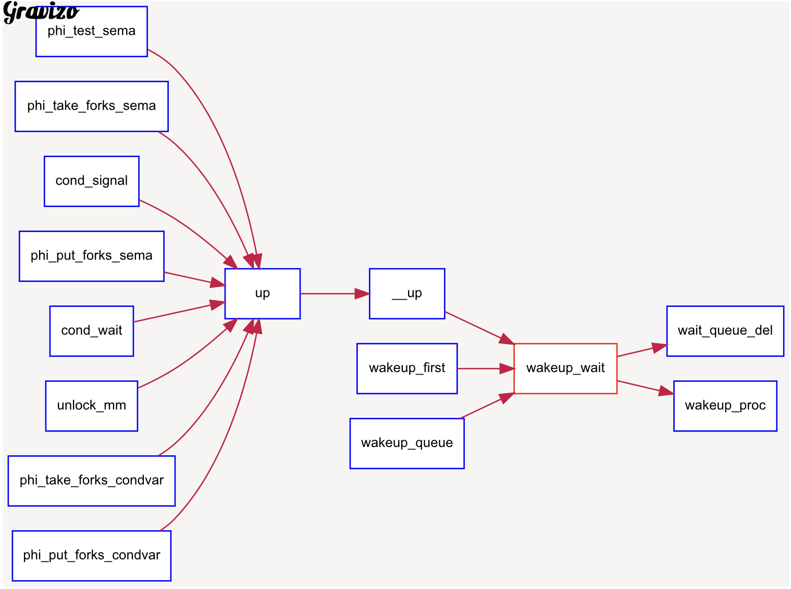
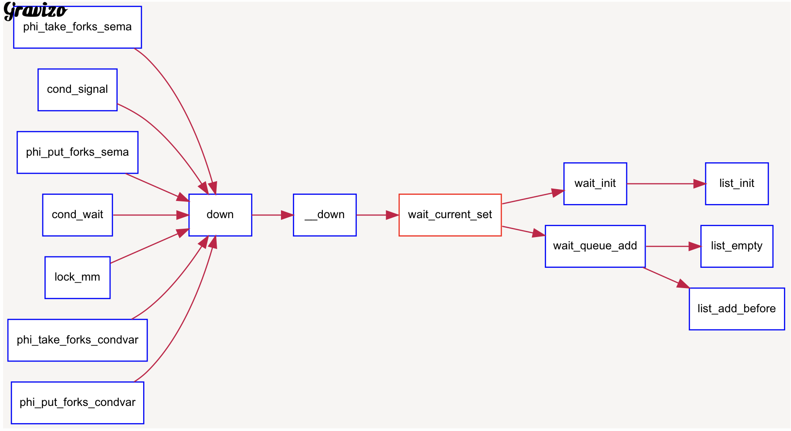
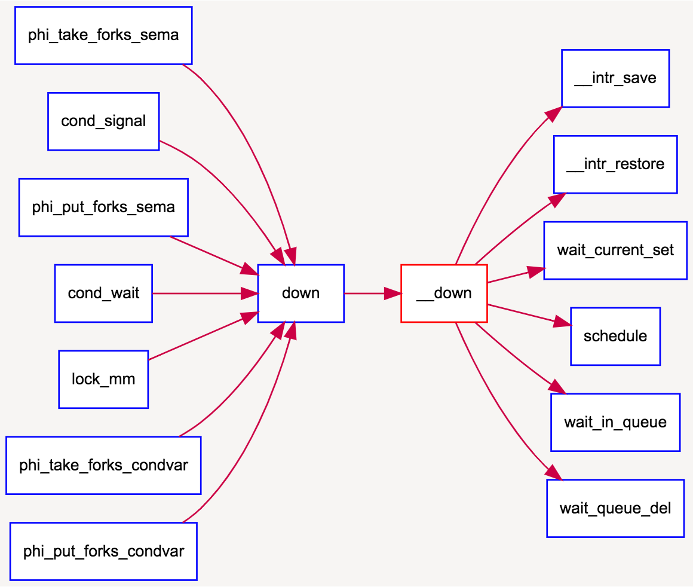
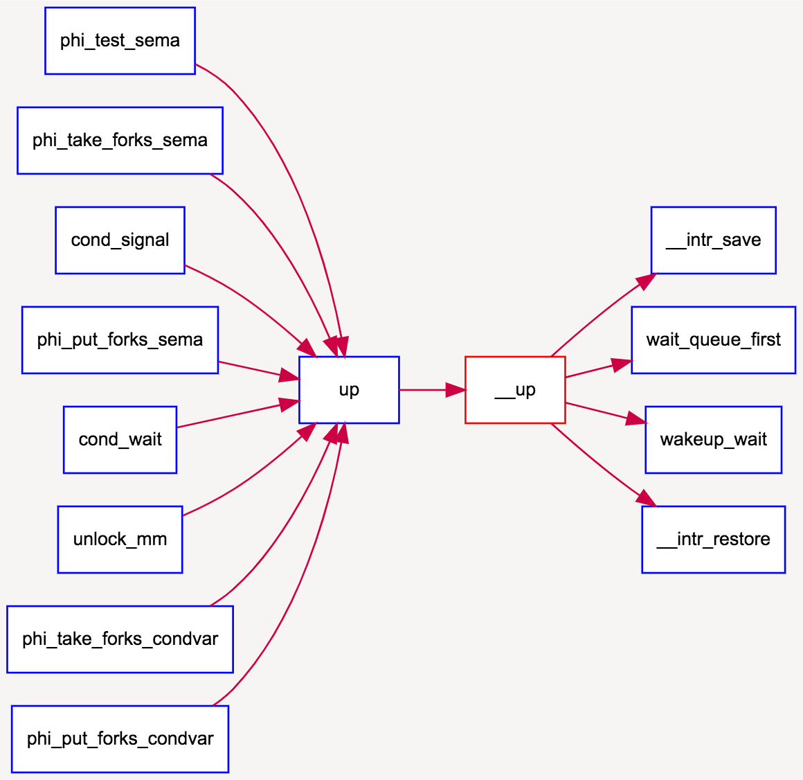

# lab7 同步问题

## note

### timer机制

timer基本数据结构，剩余时间 + 所属进程 + timer_link

```cpp
typedef struct {
    unsigned int expires;       //the expire time
    struct proc_struct *proc;   //the proc wait in this timer. If the expire time is end, then this proc will be scheduled
    list_entry_t timer_link;    //the timer list
} timer_t;
```

基本操作：init, add ,del

每个时钟中断更新时间timer_list：run_timer_list。

> 功能：遍历当前所有处在系统管理内的定时器，找出所有应该激活的计数器，并激活它们。该过程在且只在每次定时器中断时被调用。在ucore 中，其还会调用调度器事件处理程序。

### 信号量及实现

信号量需要有下面几种基本内容，其中增减函数是应为原子操作。
```cpp
struct semaphore {
int count;
queueType queue;
};
void semWait(semaphore s)
{
s.count--;
if (s.count < 0) {
/* place this process in s.queue */;
/* block this process */;
}
}
void semSignal(semaphore s)
{
s.count++;
if (s.count>= 0) { // 这里是>=吧
/* remove a process P from s.queue */;
/* place process P on ready list */;
}
}
```

一个信号量的基本数据结构，是一个value，和其对应资源的进程等待队列。

ucore中，“增” 使用 `__up()`实现，“减” 使用`__down()`实现。以`__down()`为例：

```cpp
static __noinline uint32_t __down(semaphore_t *sem, uint32_t wait_state) {
    bool intr_flag;
    local_intr_save(intr_flag); // 借助中断的关闭，达成原子操作的目的。
    if (sem->value > 0) { // 如果还没到锁的地步
        sem->value --;
        local_intr_restore(intr_flag);
        return 0;
    }
    wait_t __wait, *wait = &__wait;
    wait_current_set(&(sem->wait_queue), wait, wait_state); // 如果不够用了，为当前进程建立一个wait块，加入这个sem的wait_queue中
    local_intr_restore(intr_flag);

    schedule(); // 然后schedule

    local_intr_save(intr_flag); // 如果又回来了，首先要把自己的wait块从wait_queue中删除。否则可能会被多次重复schedule
    wait_current_del(&(sem->wait_queue), wait);
    local_intr_restore(intr_flag);

    if (wait->wakeup_flags != wait_state) { // wait_state 就是 wait 的原因。正常应该是相等的。
        return wait->wakeup_flags;
    }
    return 0;
}
void
wait_current_set(wait_queue_t *queue, wait_t *wait, uint32_t wait_state) {
    assert(current != NULL);
    wait_init(wait, current); 
    current->state = PROC_SLEEPING;
    current->wait_state = wait_state;
    wait_queue_add(queue, wait);
}
#define wait_current_del(queue, wait)                                       \
    do {                                                                    \
        if (wait_in_queue(wait)) {                                          \
            wait_queue_del(queue, wait);                                    \
        }                                                                   \
    } while (0) // 不知道为什么要while(0)

```

`__up()`中也是一样。
```cpp
static __noinline void __up(semaphore_t *sem, uint32_t wait_state) {
    bool intr_flag;
    local_intr_save(intr_flag);
    {
        wait_t *wait;
        if ((wait = wait_queue_first(&(sem->wait_queue))) == NULL) { // 如果没有进程在等待，直接++，返回
            sem->value ++;
        }
        else { 
            wakeup_wait(&(sem->wait_queue), wait, wait_state, 1); // 否则FIFO的去掉
        }
    }
    local_intr_restore(intr_flag);
}
void
wakeup_wait(wait_queue_t *queue, wait_t *wait, uint32_t wakeup_flags, bool del) { 
    if (del) {
        wait_queue_del(queue, wait);
    }
    wait->wakeup_flags = wakeup_flags;  //其实没有认识到它在做什么。。感觉在这个lab里，没有产生相应价值。。
    wakeup_proc(wait->proc);
}
```

doc上写的是错的，这里的sem->value不会降为负数。。也不能表示其等待队列的进程数。。

各种信号量V操作 调用 __up, 进一步调用 wakeup_wait, 并进一步调用 wait_queue_del, wakeup_proc。


各种信号量P操作 调用 __down, 进一步调用 wait_current_set, 并进一步调用 wait_queue_add, wait_init。







## 练习1: 理解内核级信号量的实现和基于内核级信号量的哲学家就餐问题（不需要编码）

### 哲学家就餐问题

使用kernel_thread()创建了好多个哲学家，并将标号作为参数传入。有一个临界区的mutex信号量，和每个哲学家的独自的信号量（用于阻塞自己，以及周围两个人尝试唤醒自己）。每个哲学家都执行下面的代码。“筷子”本身在信号量的方法中已经不需要了，我们可以保证这个算法不会有相邻的哲学家，和不超过（人数/2）个哲学家在同时吃饭，并且不会死锁。对于筷子，可以理解为，一次拿两根筷子，否则不拿。放筷子后，提醒身旁两位哲学家。所以哲学家是否在饥饿状态可以直接表示筷子是否正被占用。

mutex用于控制哲学家状态的改变（同一时间只有一个哲学家尝试拿筷子或放筷子）。

> 这样的情景修改影响了问题的本质吗？实质上就是观察的内容不同，但若无IPC，两者是等价的，且都可能会出现同步问题。最初始问题从单个筷子（如全部都先拿左手在拿右手）着手（因而可能出现同时拿左手筷子的死锁问题），第二个问题从左右两根筷子同时着手（等价于观察周围两人的状态）(可能出现筷子被拿起多次)。第二个问题，把管理的资源转换为了每个人相邻的两个状态。

```cpp
int philosopher_using_semaphore(void * arg) /* i：哲学家号码，从0到N-1 */
{
    int i, iter=0;
    i=(int)arg;
    cprintf("I am No.%d philosopher_sema\n",i);
    while(iter++<TIMES)
    { /* 无限循环 */
        cprintf("Iter %d, No.%d philosopher_sema is thinking\n",iter,i); /* 哲学家正在思考 */
        do_sleep(SLEEP_TIME);
        phi_take_forks_sema(i);  // 尝试拿筷子 /* 需要两只叉子，或者阻塞 */
        cprintf("Iter %d, No.%d philosopher_sema is eating\n",iter,i); /* 进餐 */
        do_sleep(SLEEP_TIME);
        phi_put_forks_sema(i); 
        /* 把两把叉子同时放回桌子 */
    }
    cprintf("No.%d philosopher_sema quit\n",i);
    return 0;    
}
void phi_take_forks_sema(int i) /* i：哲学家号码从0到N-1 */
{ 
        down(&mutex); /* 进入临界区 */
        state_sema[i]=HUNGRY; /* 记录下哲学家i饥饿的事实 */
        phi_test_sema(i); /* 试图得到两只叉子 */
        up(&mutex); /* 离开临界区 */
        down(&s[i]); /* 如果得不到叉子就阻塞 */
}
void phi_test_sema(i) /* i：哲学家号码从0到N-1 */
{ 
    if(state_sema[i]==HUNGRY&&state_sema[LEFT]!=EATING
            &&state_sema[RIGHT]!=EATING)
    {
        state_sema[i]=EATING;
        up(&s[i]);
    }
}
void phi_put_forks_sema(int i) /* i：哲学家号码从0到N-1 */
{ 
        down(&mutex); /* 进入临界区 */
        state_sema[i]=THINKING; /* 哲学家进餐结束 */
        phi_test_sema(LEFT); /* 看一下左邻居现在是否能进餐 */
        phi_test_sema(RIGHT); /* 看一下右邻居现在是否能进餐 */
        up(&mutex); /* 离开临界区 */
}
```

## 练习2: 完成内核级条件变量和基于内核级条件变量的哲学家就餐问题（需要编码）

### 管程

> 一个管程，用于封装一组有同步要求的相关资源。【先有这种同步需求的资源，然后将它们放到一个管程中】。它本质上只是（面向对象地）封装了这些资源和它们的请求函数，（就像..syscall一样..），一个被实例化的管程管理所有其他程序对它内部资源的访问。它被称为“程序”就是管程用于管理这些资源和对它们的请求。

1. 内部的函数，同一时间只有一个运行（不被block）
2. 使用队列管理请求它的程序，这个队列就是“条件变量”。当发现被运行的管程程序不在执行条件（某种“资源”不足）（比如对于生产者，队列为空），把它放入相应的“条件变量”中（如empty），让进程（对于这个函数的调用）等待（wait），让它进入block状态。在产生某个资源后，要通知（signal）对应的（消耗该资源的）“条件变量”，唤醒其中的等待进程。

#### 问题一：为何说管程不能仅有互斥操作？（比如采用忙等方式）

> ucore说，将会导致所有其他进程都无法进入临界区使得该条件为真（单核情况下）。

因为管程只允许一个进程访问它（临界区），所以必须有退出的方式。（但不清楚为何要局限于单核情况）。并且若忙等单时间片内的等待都是无效的，并且由于掌握资源的进程可能很少，所以会导致大量的CPU资源浪费。因而需要将无资源进程block掉，需要设计等待队列（条件变量）。

#### 条件变量

每个条件变量可理解为一个 进程的等待队列，其中进程都在等待某一个condition变为真。对条件变量有两个操作，wait(缺乏相应资源，本进程休眠) 与 signal(释放相应资源，并告知对应队列)。

c中实现如下。 注意一个信号量已经对应了一个队列。`monitor.mutex`用以保证只有一个进程进入管程。在某个进程使用完资源后，需要调用signal使等待资源的进程执行，但由于只有同一个进程可以使用monitor，调用signal本身就会被block，并睡在next上。其实这个时候

所有在等待队列中的进程，实际已经经过了mutex，不再受其约束。只需保证signal，wait逻辑的正确，不会出现同步问题即可。

```cpp
typedef struct monitor{
    semaphore_t mutex;      // the mutex lock for going into the routines in monitor, should be initialized to 1
    // the next semaphore is used to 
    //    (1) procs which call cond_signal funciton should DOWN next sema after UP cv.sema
    // OR (2) procs which call cond_wait funciton should UP next sema before DOWN cv.sema
    semaphore_t next;        
    int next_count;         // the number of of sleeped procs which cond_signal funciton
    condvar_t *cv;          // the condvars in monitor
} monitor_t;
typedef struct condvar{
    semaphore_t sem;        // the sem semaphore  is used to down the waiting proc, and the signaling proc should up the waiting proc
    int count;              // the number of waiters on condvar
    monitor_t * owner;      // the owner(monitor) of this condvar
} condvar_t;
```

#### 三种管程语义

see them in my mindmap

## 其他问题

1. 请在实验报告中给出给用户态进程/线程提供信号量机制的设计方案，并比较说明给内核级提供信号量机制的异同。

默认一个进程有多个线程。每个用户态信号量（可以使一个整数，类似socket），映射一个内核信号量。信号量可以以某种数据结构存在每个进程的proc_struct里。需要设计若干种syscall：创建、P/V，与删除。
> 用户的信号量需要进行syscall，这就导致了一定开销（并且会污染缓存）。实际上会先使用自旋锁，到一定时间后换成信号量。

2. 能否不用基于信号量机制来完成条件变量？如果不能，请给出理由，如果能，请给出设计说明和具体实现。

可以使用自旋锁实现（需要test and set bit的原子操作），发现没有上锁时，上锁并执行临界区代码。否则停等检查锁，直到锁被解开。

*** 

## graphviz

http://www.gravizo.com/

